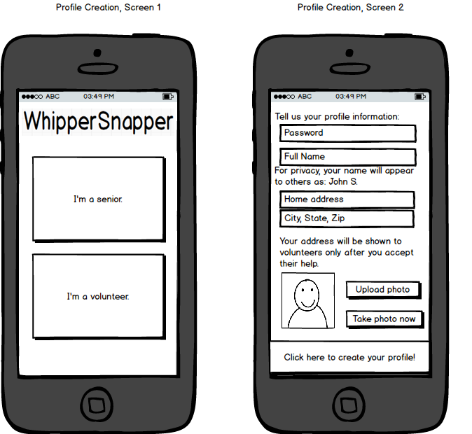
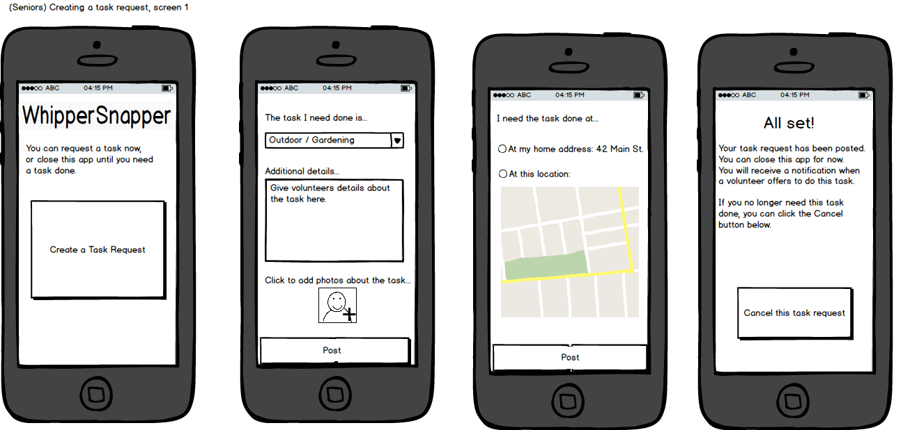
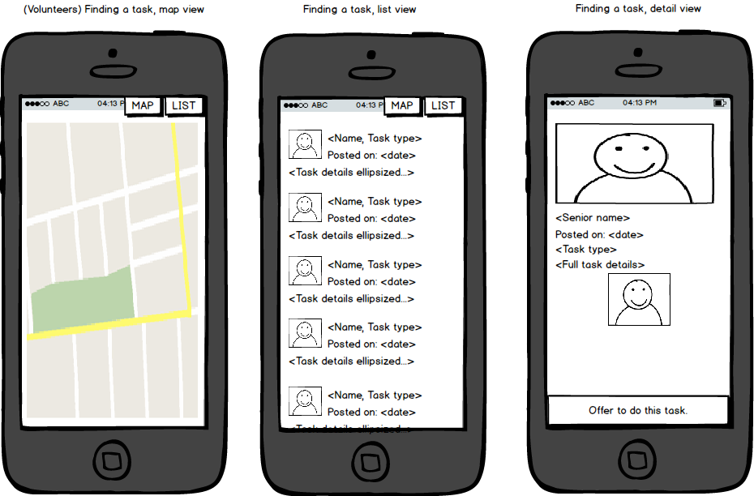
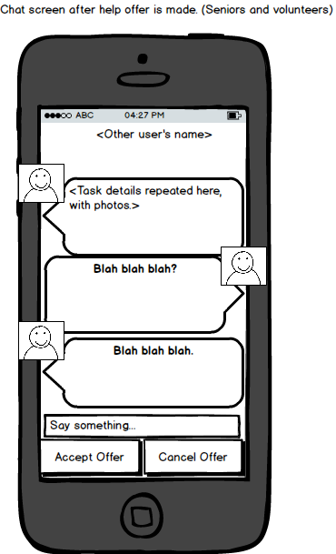

# WhipperSnapper
Project for CodePath Android class.

WhipperSnapper is an app that connects senior citizens with volunteers to help them with tasks. Whether it's moving furniture, tech support, or just having a card-playing partner, WhipperSnapper provides individual help to enable seniors to live comfortably without expensive caretakers. WhipperSnapper is a TaskRabbit app powered by the good will of the community. Volunteers can help as frequently as they want according to their own availability, without the entrance barrier of long-term commitment.

Required stories:

 * [X] Users can create profiles of their contact information.
 * [X] User can attach/take a photo to their profile.
 * [X] Seniors can posts tasks to the server.
 * [X] Seniors can attach/take a photo to their task.
 * [X] Volunteers can use a map interface to find tasks near them.
 * [X] Volunteers can use a list view to find nearby tasks.
 * [X] Seniors and volunteers can enter a chat with each other for exchanging questions and details.
 * [X] Seniors receive a system notification when a volunteer offers help for a task.
 * [X] Seniors can accept or decline an offer of help. Volunteers can decline their help offer.
 * [X] GPS will locate the user as a starting point for searches/task posts.

# Demo:

 

This demo shows:

 * (The first screen with the "I'm a senior" and "I'm a volunteer" buttons got cut in the recording.)
 * Senior user signing up, taking a photo for their profile pic and then changing to an uploaded one.
 * Senior user creating a task, selecting the "Computer / Tech Help" category and filling in details.
 * Senior takes an optional photo to attach to the task.
 * Senior sets the location based on the map, then switches back to using their home address.
 * Senior creates task and arrives at the waiting page.
 * (Volunteer sign up is skipped since it is identical to the senior user sign up.)
 * The volunteer's first page shows a map of their location and nearby task requests.
 * The volunteer can also look at a list view of nearby task requests.
 * The volunteer selects a task from the map view, an info window shows up. Clicking it takes the volunteer to the task details page.
 * The volunteer clicks on "Offer to do this task" and goes to a chat room.
 * (Off screen on a second device, the senior receives a system notification to open the chat room.)
 * The users talk in a chat room.
 * (Off screen, the senior user also has an "Accept" button.)
 * When the senior clicks the accept button, the chat room closes and the task address information is displayed.
 * (Off screen) When leaving the chat room, the senior goes back to the "Create a task" activity and the volunteer goes back to the "Find a task" activity.

# Wireframes:

 
 
 
 